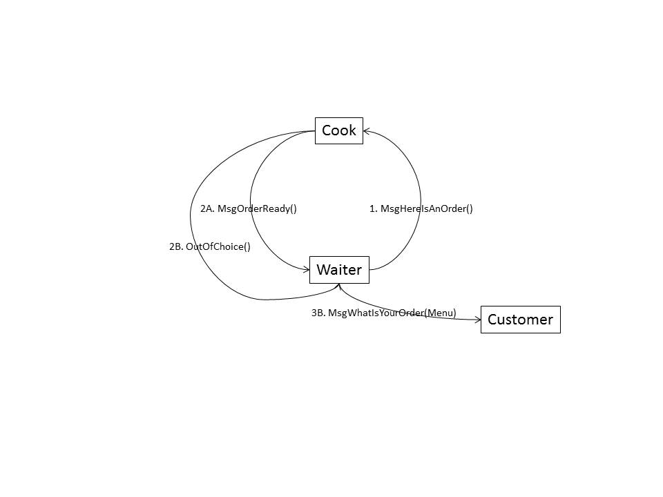
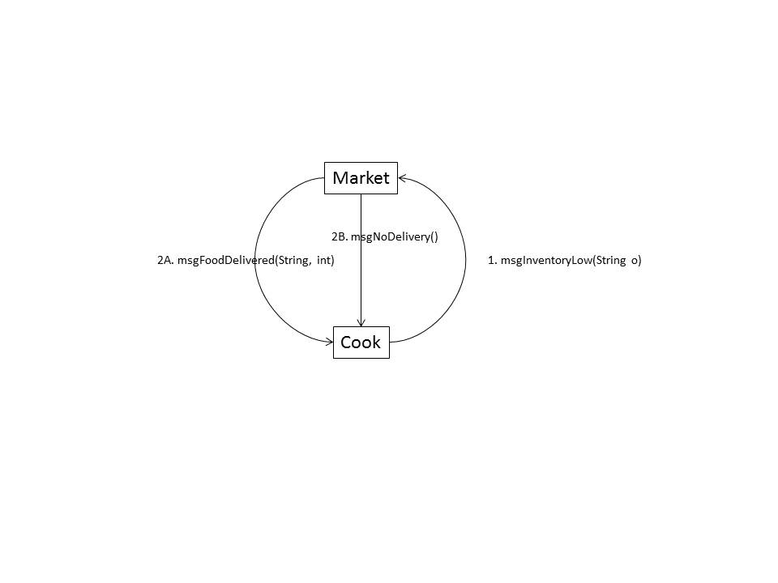
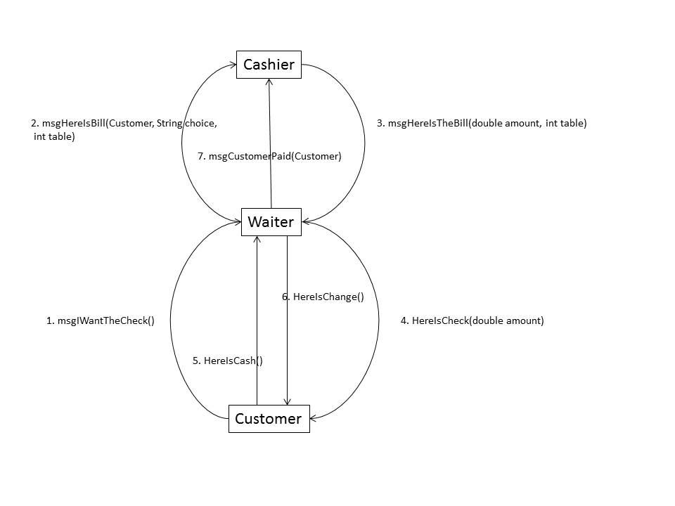
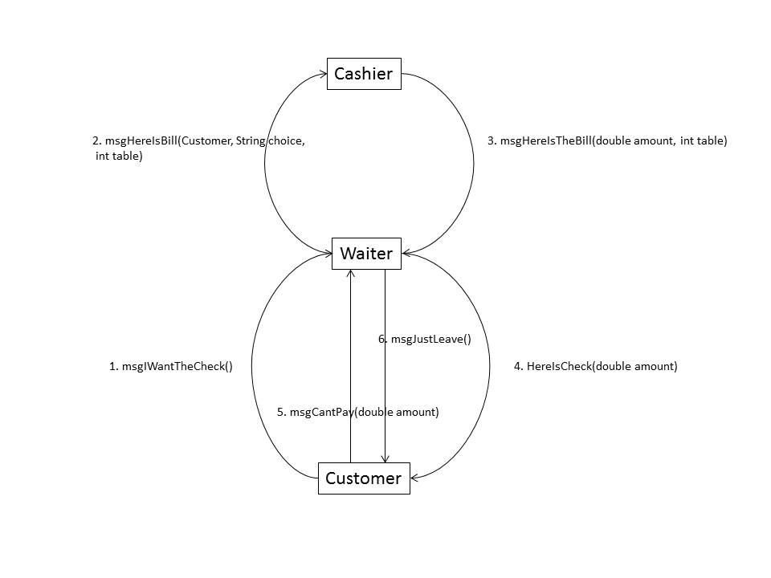

# Design Document for Agents in Restaurant v2

## Purpose/Overview
> To use agent-based design to simulate the interactions involved in the running of a restaurant. 

## Requirements
> This program has 6 major required upgrades on the v1 Restaurant

> 1. Add a Waiter class that is responsible for seating Customers, taking their orders, relaying those orders to the cook, and delivering the order to the customer's table.
> 2. Add a Cook class that is responsible for receiving orders and cooking the appropriate meal for each customer.
> 3. Allow the user to add multiple functioning Waiters to the restaurant through the GUI
> 4. Allow customers to choose different meals, and differentiate these meals in the GUI
> 5. Consolidate the GUI and the Animation panel into a single window
> 6. Implement a Pause button from the GUI that pauses the entire simulation.

## Interaction Diagrams
###v2 Diagram

###Waiter Break Scenario

###Customer Reordering Scenario

###Cook-Market Scenario

###Customer Payment Scenarios 

## Agent Summary 

###Host 

1. Data
  + `List<Customer> waitingCustomers` - queue of customers waiting to be seated
  + `List<Customer> leavingCustomers` - customers that decide to leave, and have to be removed from waiters' lists
  + `List<Waiter> availableWaiters` - list of waiter available to help customers
  + `List<Waiter> busyWaiters - list of waiters that already have a customer, but can take more
  + `List<Waiter> breakWaiters - list of waiter that are on break
  + `Collection<Table>` tables - all available tables
2. Messages
  + msgIWantFood(CustomerAgent cust){ waitingCustomers.add(cust); }
  + msgCancelSeating(CustomerAgent cust){ 
  + if there exists a customer matching cust in waiting customers 
  +  waitingCustomers.remove(cust)
  +}
  + msgIWantABreak(WaiterAgent w){ 
  + If there exists another waiter in busyWaiters or availableWaiters
  +  breakWaiters.add(w)
  +  availableWaiters.remove(w);
  +  busyWaiters.remove(w);
  +}
  + msgImBack(WaiterAgent a){availableWaiters.add(a);}
  +
  + msgTableCleared(CustomerAgent cust, WaiterAgent wait){  
  + 
  
  >     If there exists a table in tables such that  
  >		table.customer matches cust  
  >				table.setUnoccupied()  
  >				availableWaiters.add(wait)  

3. Scheduler 
>       If leavingCustomers is not empty
>              clearCustomer()
>       If breakWaiters is not empty
>              breakWait()
>
>		If waitingCustomers is not empty and
>			If there exists a table in tables such that
>				table.isUnoccupied() and
>					If availableWaiters is not empty
>					 then availableWaiters.first().msgSitAtTable(waitingCustomers.first, table.getNumber());
>
4. Actions   
+  clearCustomer() - proceed through the list of waiters and remove any customer that is on the leavingCustomer list
+  breakWait() - proceed through breakWaiters and message them all to go on break

### Waiter
  
1. Data
	+ `List<myCustomer> myCustomers` - list of myCustomer objects that the waiter must serve
	
		`class myCustomer{
			Customer c; int t; String choice; CustomerState s;
		}`
	+ `Menu todaysMenu` - list of items available for the cutomer to order

2. Messages 
	+ msgSitAtTable(CustomerAgent cust, int tNum){ myCustomers.add(new myCustomer(cust, tNum));}
	+ msgRemoveCustomer(CustomerAgent c){ customers.remove(c);}
	+ msgReadytoOrder(CustomerAgent cust){
	
	
  >  	  If there exists a myCustomer in myCustomers such that 
	   		myCustomer.c = cust
		then myCustomer.s = cust.s}  
  
	+ msgCustomerOrder(CustomerAgent cust, String choice){
	
	
  >		If there exists a myCustomer in myCustomers such that 
			myCustomer.c = cust
		then myCustomer.choice = cust.choice}  

		
    + msgOrderReceived(CustomerAgent cust, String choice)- take the customer's order and apply it to the appropriate myCustomer object, alter the state to Ordering
	+ msgOutOfChoice(String choice) - instruct the customer to order again, as their selection is out of stock
	+ msgOrderReady(Order myOrder){
	
  	
    >		If there exists a Customer in myCustomers such that 
			myCustomer.c = myOrder.c
		then myCustomer.state = delivering;}
    + msgIWantCheck(CustomerAgent c) - customer's state is changed to WaitingForBill
	+ msgHereIsBill(CustomerAgent c, double amount) - from the cashier, changes customer's state to Paying
	+ msgHereIsCash(CustomerAgent c, double value) - receipt of money from the customer, state changed to Leaving
	+ msgJustLeave(CustomerAgent c) - if the customer cannot pay, tells them to leave and pay next time
	+ msgLeavingTable(CustomerAgent cust){
  >		If there exists a myCustomer in myCustomers such that 
			myCustomer.c = cust
		then {myCustomers.remove(myCustomer);}
	+ msgGoOnBreak() - informs the waiter it's okay to break
	+ msgWantToBreak() - from GUI, tells waiter to ask host for break
    + msgAtTable() 	 - from GUI, releases Semaphore when at the table
	+ msgAtCook() - from GUI, release Semaphore when at the cook 

		
3. Scheduler

>   If there exists a myCustomer in myCustomers such that  
			if (onBreak)
				return true;
			if (customer.getState() == CustState.Waiting){
				seatCustomer();
				return true;
			} else if (customer.getState() == CustState.Seated || customer.getState() == CustState.OrderAgain){
				getOrder();
				return true;
			} else if (customer.getState() == CustState.Ordering){
				takeOrderToCook();
				return true;
			} else if (customer.getState() == CustState.Delivering){
				deliverFood();
				return true;
			} else if (customer.getState() == CustState.WaitingForBill){
				getBill();
				return true;
			} else if (customer.getState() == CustState.Paying){
				takeBill();
				return true;
			} else if (customer.getState() == CustState.Paid){
				customerPaid();
			} else if (customer.getState() == CustState.NoPay){
				customerNoPay();
			} else if (customer.getState() == CustState.Done){
				LeaveTable();
			} else if (customer.getState() == CustState.Leaving){
				LeaveTable();
				customers.remove(customer);
				if (customers.isEmpty())
					customer = null;
			}
		

4. Actions 
	+ seatCustomer(CustomerAgent customer, int tNum){
	
	>	customer.setTableNum(tNum);
	>	customer.msgSitAtTable();
	>	}
	+ getOrder() - takes order from customer
	
	
###Customer 

1. Data
2. Messages
	+ gotHungry() - from GUI, sets event to gotHungry
	+ msgSitAtTable(){  
	
	>  Change event to followHost}
	+ msgWhatisYourOrder(){
	
	>  Change event to readyToOrder}
	+ msgOrderReceived(){
	
	>  Change event to Eating}
3. Scheduler  

		if (state == AgentState.DoingNothing && event == AgentEvent.gotHungry ){
			state = AgentState.WaitingInRestaurant;
			goToRestaurant();
			return true;
		}
		if (state == AgentState.WaitingInRestaurant && event == AgentEvent.followHost ){
			state = AgentState.BeingSeated;
			SitDown();
			return true;
		}
		if (state == AgentState.BeingSeated && event == AgentEvent.seated){
			state = AgentState.Ordering;
			OrderFood();
			return true;
		}
		
		if (state == AgentState.Ordering && event == AgentEvent.readyToOrder){
			state = AgentState.Eating;
			EatFood();
			return true;
		}

		if (state == AgentState.Eating && event == AgentEvent.doneEating){
			state = AgentState.Leaving;
			leaveTable();
			return true;
		}
		if (state == AgentState.Leaving && event == AgentEvent.doneLeaving){
			state = AgentState.DoingNothing;
			//no action
			return true;
		}
		return false;
	}
4. Actions
	+ goToRestaurant() - tells the Host to seat the customer
	+ SitDown() - tells the GUI to animate the sitting motion
	+ OrderFood() - has the customer make a choice and sends that choice to the Host 
	+ EatFood() - the customer eats the food
	+ leaveTable() - the customer is done eating, and the GUI can animate him leaving the restaurant

##Cook
1. Data 
	+ `List<Order> pendingOrders` - list of Orders that the cook must fill 
	
	> class Order{
	>Waiter w; String c; int t;
	>}
2. Messages
	+ msgHereIsAnOrder(Waiter wait, String choice, int tNum){
	
	> pendingOrders.add(new Order(wait, choice, tNum) }
	
3. Scheduler

>	If there exists an order in pendingOrders
>		CookOrder(order);

4. Actions
	+CookOrder(Order){
	
	>	Do("Cooking");
	>	timer.schedule(new TimerTask() {
	>		waiter.OrderisReady(Order)
	>	},1000);
## Market
1. Data 
   +Inventory myStock - Inventory contains a HashMap that relates String choices with Integer amounts 
   +List<String> delivery - stores the food to be delivered to the cook
2. Messages 
   +msgInventoryLow(CookAgent c, String o) - add o to delivery 
3. Scheduler 
   if (there is a pending delivery)
	  sendFood()
4. Actions 
   +sendFood() - remove the first entry of delivery. Send up to 5 units of food to the cook. If you're out message the cook that you can't deliver it.
## Cashier 
1. Data 
   + List<Order> pendingOrders - used to process amount owed by customers
   + Map<CustomerAgent, Double> owingCustomers - stores customers and the amount they owe 
2. Messages
   + msgHereIsBill(WaiterAgent w, CustomerAgent c, String choice, int table) - adds a new order containing this info to pendingOrders, adds c to owingCustomers
   + msgCustomerPaid(CustomerAgent c) - removes c from owingCustomers
3. Scheduler 
   + If there exists an order in pendingOrders() - calculate that bill, then remove the order 
4. Actions 
   + CalculateBill(Order o) - check if a customer owes from a previous visit, updates owingCustomers with the amount due, and messages the waiter with that amount